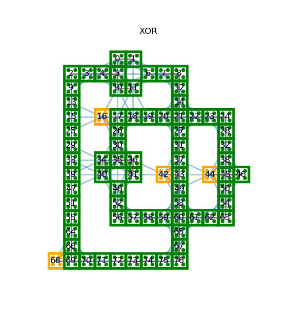

.. index-start-marker

qca-tools
=============

``qca-tools`` is a collection of methods and utilities for the simulation of Quantum-dot Cellular Automata (QCA) networks. It provides a composites interface to be used together with
the `D-Wave Ocean <http://dw-docs.readthedocs.io/en/latest/overview/stack.html#stack>`_ software stack.

.. index-end-marker

Installation
------------
.. installation-start-marker
To install from source:

.. code-block:: bash

  python setup.py install

.. installation-end-marker

Example Usage
-------------
.. examples-start-marker

.. code-block:: python

  from qca_tools import QCAComposite
  from dimod.reference.samplers import SimulatedAnnealingSampler

  # Set-up file path
  dir = './benchmarks/'
  qca_filename = 'XOR.qca'
  filepath = os.path.join(dir, qca_filename)

  # Create sampler
  child_sampler = SimulatedAnnealingSampler()
  qca_sampler = QCAComposite(child_sampler, qca_filename)

  # Collect samples
  response = qca_sampler.sample()

A drawing of the QCA network can be generated using the NetworkX interpretation method. Either directly from a previously parsed QCANetwork:

.. code-block:: python

  # Using the sampler above
  qca_network = qca_sampler.get_qca_network()
  # Get NetworkX from QCA
  QCAnx = QCANetworkX(qca_network)
  QCAnx.draw_qca(with_labels=True)  

Or from a *.qca file:

.. code-block:: python

  # From file
  QCAnx = QCANetworkX.from_qca_file(filepath, ancilla=True, r_max=R_MAX)
  QCAnx.draw_qca(with_labels=True)

.. examples-end-marker
